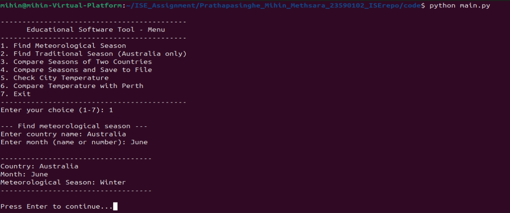
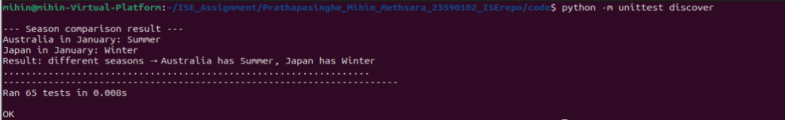
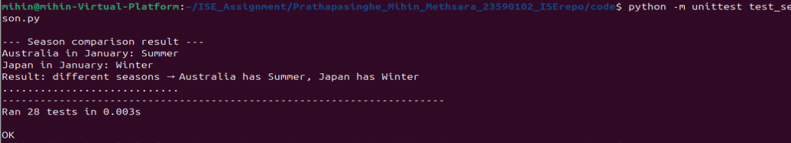
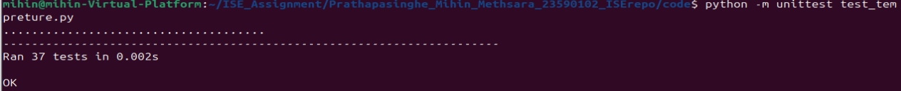
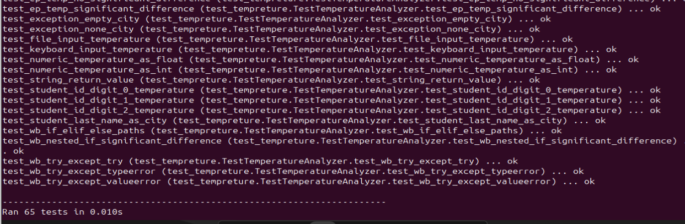

# Introduction to Software Engineering Assignment

---

**Assessment:** Introduction to Software Engineering - ISAD1000 Assignment

**Student Name:** Mihin Methsara Prathapasinghe

**Student ID:** 23590102

**Semester:** 2026 Semester 1


## Project Overview
This project is a software system developed to analyze season and temperature data.  
It is built using modular design, testing techniques, and good software engineering practices.

---

##  <u>Introduction</u>

This report explains the design, development, and testing of an educational software application that teaches users about seasonal changes in different cultures and temperature differences between cities.

### Deliverables

The system is designed to handle two key use cases:

**Scenario A  – Finding seasons**
- Given a country and month, return the meteorological season
- Given Australia and a month, return the traditional noongar season
- Given two countries and a month, determine if their seasons are the same

**Scenario B – Temperature analysis**
- Given a city, temperature, and time of day, compare with average temperature
- Display warning if temperature difference by more than 6°c
- Compare any city's temperature with perth's average


### Key Achievements

- modular python seven files following high cohesion and low coupling
- unit tests covering equivalence partitioning, boundary value analysis, and white-box path testing
- Complete test use for parameter, keyboard, and file inputs
- Complete test use return, console, and file outputs
- Student data test ID digits (1,0,2) and last name (Prathapasinghe)
- Full git version control with refactoring and mergr parts history


## <u>Production code design and module descriptions</u>

### Design Decisions

I designed the system by organizing it into clear, separate seven modules. The project is divided into logical parts, where each file represents a different feature or function of the application with following module principles.


- High cohesion : Each module does one specific job, so the code is easier to understand and test.
- Low coupling : Modules work independently and share data only through function inputs and imports, not global variables.
- No redundancy : Common validation code is placed in input_validator.py so it is not repeated multiple places.
- Clear dependency direction: Higher-level modules like season_finder.py and temperature_analyzer.py use lower-level modules like input_validator.py and data. This keeps dependencies in one direction only and avoids loops, making the code easier to manage.


### Module 1 - Season finder (`season_finder.py`)

| Property | Description |
|----------|-------------|
| Purpose | Find meteorological/monsoon season for any supported country |
| Imports | country(string), month (string or int) with parameter passing |
| Exports | Season name (string) or error message it is return value |
| Behaviour | Normalizes inputs, validates country and month, searches season dictionary and returns matching season |
| Dependencies | data py, input_validator.py |
| Exceptions | Returns error messages so no exception raising |


### Module 2- Traditional season finder (`season_finder.py`)

| Property | Description |
|----------|-------------|
| Purpose | Find traditional noongar season for australia |
| Imports | country(string), month(string or int) use parameter passing |
| Exports | Season name(string) or error message  |
| Behaviour | Only works for australia to find, returns "No traditional season" for other countries |
| Dependencies | data.py, input_validator.py|
| Exceptions | only returns error strings|


### Module 3 - Season comparator (`season_comparator.py`)

| Property | Description |
|----------|-------------|
| Purpose | Compare seasons of two countries |
| Imports | country1 ,country2(strings), month(string orint) |
| Exports | Boolean (true or false) and console output |
| Behaviour | calls module 1 for both countries  and prints comparison and returns reult |
| Dependencies | season_finder.py |
| Exceptions | No exceptions raised and return false if country or month is invalid |


### Module 4- Temperature analyzer(`temperature_analyzer.py`)

| Property | Description |
|----------|-------------|
| Purpose | Compare temperature with city average |
| Imports | city(string), tempreture(float,int), time of day(string) |
| Exports | message(string) or error message |
| Behaviour | Validates city,time and  checks temperature range with data compares with average, adds warning if  difference > 6°C |
| Dependencies | data.py, input_validator.py |
| Exceptions | no exceptions raised and use try except internally to catch typeerror and valueerror, but returns error strings instead of raising exceptions like "error- temperature cannot be none", |

### Module 5 - Perth comparator (`perth_comparator.py`)

| Property | Description |
|--------------|-----------------|
| Purpose | Compare any city's temperature with perths average |
| Imports | city(string) , tempreture (float,int), time of day (string)  |
| Exports | result message (string)  |
| Behaviour | Validates inputs then retrieves perth average and compare it with given cites and  returns comparison result |
| Dependencies | data.py, input_validator.py |
| Exceptions |  Returns error strings- "invalid city", "invalid time of day" |


### Module 6 - Input validator (`input_validator.py`)

| Property | Description |
|----------|-------------|
| Purpose | Centralized validation parts for all modules |
| Imports | Various data including country, month, city, time, tempreture|
| Exports | Normalized values or boolean results  |
| Behaviour | Normalizes country, month, city, and time inputs; checks them against definrd data and ensures values are within valid ranges. |
| Dependencies | data.py|
| Exceptions |  validate_month_strict() raises exceptions for invalid inputs, such as typeerror when the input is none and value error when the month value is not valid. Other functions handle errors by returning none or error messages instead of raising exceptions. |


### Module 7 - Data (`data.py`)

| Property | Description |
|----------|-------------|
| Purpose | Centralized data  |
| Imports | None |
| Exports | data dictionaries for imported for other modules |
| Behaviour | Stores season data, temperature averages and  ranges |


### Assumptions I made from my modules

- Month inputs can be given as full names,  numbers (1–12) to support different user input styles.

- Temperature values are assumed to be accurate up to one decimal place, as defined in the specification.

- Traditional (Noongar) seasons are only applicable to Australia; for other countries, the system returns a message indicating no traditional season is available.

- The system supports only a fixed set of countries: Australia, Sri Lanka, Japan, Mauritius, Malaysia, and Spain.

- Supported cities are limited to Perth, Adelaide, and Brisbane based on the project requirements.

- Valid temperature ranges are defined in city_Ranges, and any value outside these limits  treate as invalid input.

- A significant difference warning  triggered only when the temperature difference is greater than 6°C but not equal to 6°C.

- Input validation most  handled using error messages instead of exceptions to keep the program user friendly and prevent crashes.


## <u>Production code implementation </u>

### Run the program to view module output

- go to code directory

```bash
cd code/
```
- run main program

```bash
python main.py 
```




### Modularity concepts how I apply for production code

- **High Cohesion** - Each module is designed to focus on one clear task only. For example my code season_finder.py is responsible only for finding seasons and  temperature_analyzer.py is responsible only for analyzing temperature data also input_validator.py handles only input validation. This separation keeps the code organized, easier to understand, and simpler to test  and update.


- **Low coupling** - this maintained in my design by keeping modules independent from each other. Modules communicate only through function inputs and return values, not global variables, so changes in one module do not affect others. My code uses no global variables, and all functions take inputs through parameters like get_meteorological_season(), check_city_temperature(), and compare_withperth(), and return results like season names or messages instead of changing shared data.


- **No redundancy** - this applied in my design by writing common validation code once in input_validator.py and reusing it in other modules. like normalize_month() and normalize_time() are defined in input_validator.py and used in season_finder.py, temperature_analyzer.py, and perth_comparator.py. This avoids repeating code, reduces duplication, and makes the system easier to maintain.

<br>

### Review checklist before refactor (initial Code) 

- Here is how my initial code looked before- overall worked but was not very modular. It failed some checklist parts

**1. Single responsibility : <u>no </u>**
- I had season logic mixed with comparison logic in the same file. Temperature analysis and Perth comparison were also together. Validation code was scattered across different modules instead of being in one place.

**2. No global variables : <u>no  </u>**
- I used hardcoded values like "Summer", "Winter", and "Perth" directly inside functions instead of storing them as constants. This means some data is written inside the logic code rather than being separated into a data file


**3. No control flags : <u>yes </u>**  
- I did not use boolean parameters to change function behavior.

**4 parameters6 or fewer : <u>yes </u>**
- my functions already had 2-3 parameters, so this was fine.for example, get_meteorological_season(country, month) has 2 parameters, and check_city_temperature(city, temp, time_of_day) has 3 parameters.

**5. No code duplication : <u>no </u>**
- month validation was repeated in multiple modules. City validation was also duplicated. There was no central validator module, so the same checking logic appeared in several places.


<br>


### Refactoring decisions 

Based on the my review checklist, I improved the production code with the following changes-

- **Moved data to data .py:** 
All season mappings, temperature values, and validation lists were moved into one file instead of being written inside functions. This removed hardcoded values and made data easier to update.

- **Centralized validation in input_validator.py:**
 All input checks like country, month, city, and time normalization were written once and reused across modules. This reduced duplication and followed a consistent validation approach.

- **Split into separate modules:** 
The code was divided into smaller modules (season_finder.py, season_comparator.py, temperature_analyzer.py, and perth_comparator.py), where each module has one clear purpose.

- **Separated user interaction:** 
Input and output handling were removed from logic modules and placed in main.py, so core modules only focus on processing data.
Added file output feature: A function was added to write season comparison results to a file for testing and output verification.


<br>

###  Review checklist after refactor -final parts 

- After refactoring, here  how my code improved-

**1. Single responsibility : <u>yes </u>** 
 - now each module does only one job. season_finder.py only finds seasons. season_comparator.py only compares seasons. temperature_analyzer.py only analyzes temperatures. perth_comparator.py only compares with perth. and input_validator.py only validates inputsalso  data.py only stores constants. main.py only handles the menu and user interface.

**2. No global variables : <u>yes </u>** 
- all hardcoded values are now in data.py with UPPER_CASE constant names. No magic strings exist in the logic modules anymore. Everything is imported from the data file.

**3. No control flags : <u>yes </u>** 
- I kept this  from the beginning.


**4 parameters6 or fewer : <u>yes </u>** – my functions alredy have 1-3 parameters with initial.

**5. No code duplication : <u>yes </u>** 
- all validation logic is now written once inside input validator file. Functions like normalize_month(), normalize_city, and normalize_time are defined in one place and reused by season finder, temperature analyzer, and perth comparator. 


<br>


## <u>Test cases for all parts </u>

## Black box test cases

### 1.Equivalence partitioning 

- I identified different types of behaviour from each module’s specification and selected one test case for each type. This helps ensure all main behaviours are tested.

#### Season finder - meteorological seasons

| Module | Category | Test Data  | Expected Result  |
|--------|----------|-----------|-----------------|
| get_meteorological_season| Australia Summer | "australia", "january" | summer |
| get_meteorological_season | Australia Autumn | "australia", "april"    | autumn  |
| get_meteorological_season  | Australia Winter   | "australia", "july" | winter |
| check_seasons_same | same season | "Australia", "Japan", "January"  | true |
| check_city_temperature| above average | "Perth", 25.0, "morning" | contains "above" |
| check_city_temperature | invalid city | "Sydney", 25.0, "morning"  | invalid city |


- This technique divides all possible inputs to categories that  expected to produce  same behaviour.Instead of testing every possible input becaus it not practical I select one representative value from each category. for example, testing "january" represents all summer months (december, january,february).If the module works correctly for january,it should also work for the other months  same group.This approach saves time while still helping to find important bugs.

<br>


### 2.Boundary value analysis 

| Module | Boundary | Test Data | Expected Result |
|--------|----------|-----------|-----------------|
| check_city_temperature | 6 c | "Perth", 24.2, "morning" | No "significant difference" |
| check_city_temperature| above 6  | "Perth", 24.3, "morning" | show "significant difference" |
| check_city_temperature  | above min avg | "Perth", 1.0, "morning" | no "below minimum" |
| check_city_temperature | below min avg | "Perth", 0.6, "morning" | show  "below minimum" |

- bva focuses on testing values at the edges where behaviour changes because many mistakes happen  these boundary points. For example rule says the warning  triggered only when the difference more than 6c , so I test values like  exact boundary and just above it to check it works correctly. I also test values just below and just above perths minimum  and maximum  to make sure the system handles limits properly.

<br>


### 3.Student data tests

 Test Data | Expected Result   |
|-----------|-----------------|
| get_meteorological_season("Australia", 1)`  | summer |
| get_meteorological_season("Australia", 0)` | invalid month  |
| check_city_temperature("Perth", 2.0, "morning" ) | below average   |
| check_city_temperature("Prathapasinghe", 25.0, "morning") |  invalid city |

- using my id digits and last name as test data, I used digit 1 as month 1 it get january- summer , digit 0 get as an invalid month (0 error), and my last name as an invalid city input to verify that the system correctly detects and handles invalid inputs.

<br>


## 5.White box test cases

### if and if-else paths test

| Function | Construct | Path | Test Data | Expected Result |
|----------|-----------|------|-----------|-----------------|
| get_meteorological_season | if` | Enter if valid country | "Australia", "january" | summer |
| get_meteorological_season | if  | Skip if invalid country| "XYZ", "january" |invalid country |
| compare_with_perth | if elif else | Warmer path  | "Adelaide", 25.0, "afternoon"| show warmer |

- I used this approach  each if statement create two possible paths to the code.The program can  go inside the if block when the condition  true or skip it when the condition  false. I test both paths to make sure the module works correctly each case.for example,get_meteorological_season, I test a valid country to enter the if block and an invalid country to trigger error handling path


<br>


### Loop paths tests

| Function | Construct | Path | Test Data | Expected Result |
|----------|-----------|------|-----------|-----------------|
| get_meteorological_season  | for loop  | enter loop and finds match| "Australia", "January" | summer |
| get_meteorological_season | for loop   | exit loop when no match | "Australia", "XYZ"  |invalid month |


- I used this approach loops have two main paths one the loop does not run at all, and loop runs once or multiple times treated as the same.for for loop  get_meteorological_season I test both cases when the loop runs and finds a matching season, and when it runs but does not find a match, which leads to the error case for an invalid month.


<br>


### exception tests

| Function  | Construct  | Path  | Test Data  | Expected Result  |
|----------|-----------|------|----------- |-----------------|
| check_city_temperature | try except | try success | "Perth", 25.5, "morning" | returns temperature analysis |
| check_city_temperature |  try except | expect typeerror  | "Perth", none, "morning" | returns error message |
| check_city_temperature  | try except | expect valueerror   | "Perth", "abc", "morning"  | returns error message   |


<br>


## <u>Test implementation </u>

### run Tests

- go to code directory

```bash
cd code/
```
- run all test

```bash
python -m unittest discover 
```
- run test separete files

```bash
python -m unittest test_season.py
python -m unittest test_tempreture.py
```

- run test files with details

```bash
python -m unittest -v
```







<br>


## <u>Traceability matrix</u>

| Module Name     | BB (EP)     | BB (BVA)   | WB | Data types | Form of input and output | EP | BVA | White-Box |
|-------------|---------|----------|-----|-------------|----------------------|-----|-----|-----------|
| get_meteorological_season |  done |  done | done    | string, int | parameter , return value | done | done    | done  |
| get_traditional_season  | done  | not done    | not done | string  | parameter , return value| done | not done    | not done |
| check_seasons_same   | done  | not done | done   | string, int, bool  | parameter ,console output and return value   | done  | not done  | done | 
| check_city_temperature  | done    | done    | done  | string, int, float  | parameter , return value| done  | done | done |
| compare_with_perth | done  | not done  | done | string, int, float  | parameter , return value  | done  | not done | done |
 


<br>


## <u>Version control</u>

### Git repository information

**Repository name:** `Prathapasinghe_Mihin_Methsara_23590102_ISErepo`

**Branch structure-**

- **main** - Initial project structure 
- **feature/season** - Season functionality development 
- **feature/temperature** - Temperature functionality development 
- **feature/testing** - Test development |
- **feature/refactoring** - Final refactored code

### Git log


### Branch merge steps


**1. feature / season** – Developed intial season functions meteorological and traditional seasons

**2. feature / temperature** – Developed temperature initial functions temperature analysis and perth comparison

**3. feature / testing** – Developed unit tests files

**4. feature / documentation**  – Make  the report and documentation in markdown format

**5. feature / refactoring**  – Create as  integration branch for code. merged feature/season, feature/temperature , and  feature/testing  into this branch, then applied refactoring.

**6. develop**  – created as main integration branch. Merged feature/refactoring (production code and test code) and  feature/documentation branches to this branch for test submission

**7. main**  – Final merge from develop branch for submission

**Merges confirmed in git log:**
- `56839af` – Merged `feature/season` into `feature/refactoring`
- `022e626` – Merged `feature/temperature` into `feature/refactoring`
- `2cb5808` – Merged `feature/testing` into `feature/refactoring`


<br>


## <u>Challenges faced</u>


- **Ensuring test isolation and cleanup** – Implemented setUp and tearDown fixtures that automatically delete temporary files after each test

- **Avoiding code duplication across season and temperature modules** – Created shared input_validator.py  module that both modules use for validation

- **White box testing for exception paths** – Added validate_month_strict() function that raises type error and value error  exceptions

- **Did not create  develop  branch at the beginning** – Created  develop branch at the end, merged  feature/refactoring  and  feature/documentation  into it for for test before submission , then merged develop into main branch for final submission


<br>


## <u>Discussion things I achieve</u>


**1.Full functionality implemented –** All assignment requirements were completed and tested, including finding seasons, comparing seasons between countries, checking temperature differences against averages, and showing warnings when the temperature difference is more than 6°C.

**2. Modular design –** The system is split into seven modules (data.py, input_validator.py, season_finder.py, season_comparator.py, temperature_analyzer.py, perth_comparator.py, and main.py). Each module has one clear responsibility, making the system easier to understand, test, and maintain.

**3. Comprehensive testing –** I used three testing methods: equivalence partitioning, boundary value analysis, and white-box testing. These tests cover different input types, input methods, and output methods.

**Version control –** I used git with feature branches to manage development work in an organized way, and all changes are tracked with clear commit messages.


<br>


## <u>Conclusion</u>

- I successfully built and tested the system. It follows good design practices like splitting the code into module s, giving each module one clear job, and avoiding duplicate code. I used different testing methods, including black box and white box testing, to check that everything works correctly.Also I used git  with feature branches to manage the project and track changes.
Overall, my project meets all requirements and works as expected.
